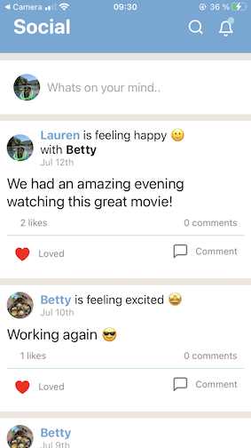
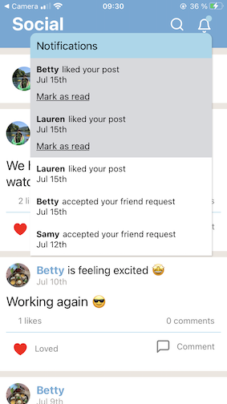
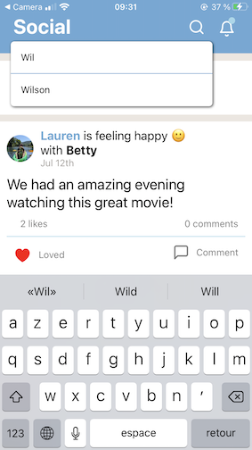
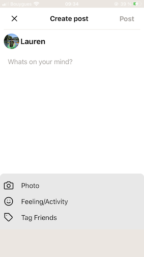
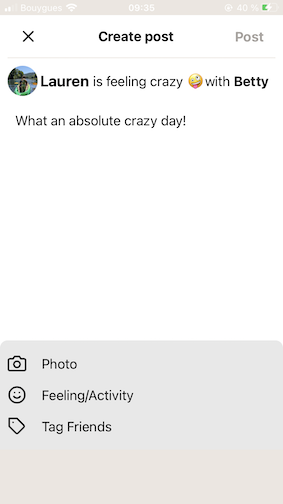
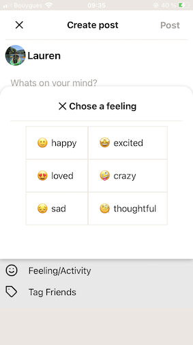
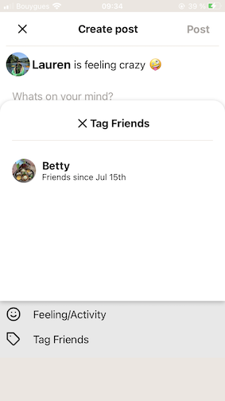
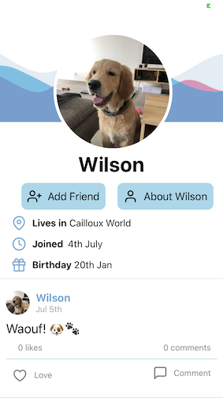

# Social

## Introduction

Early stage project, so still in progress

Social is a facebook alike mobile app that allows you to:

- Search for other social users
- View your/other profiles
- Edit profile info, upload profile & cover images
- Add/Accept friend requests
- Add Posts
- Add Feelings & tag friends on posts
- Add comments & like posts

## Tech

Social is a React Native (js) app, run with Firebase/Firestore, Storage.
And using Cloud functions for the first time!! :) (essentially for Algolia for now)

## Screenshots

